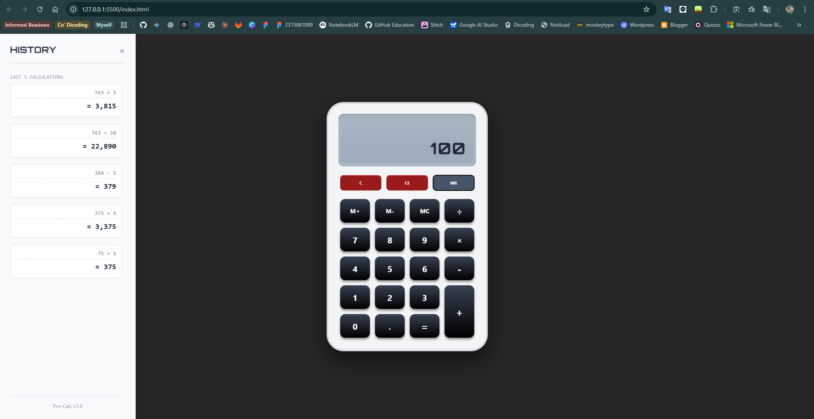
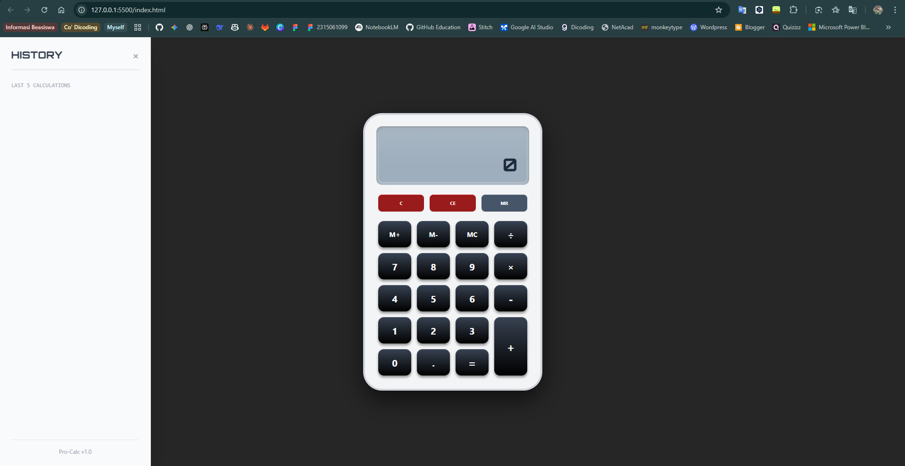
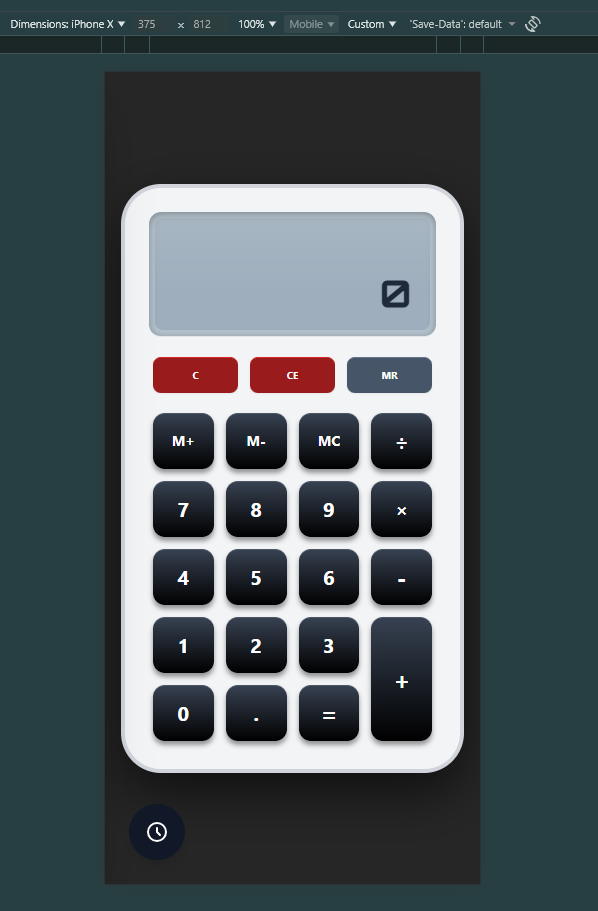

# Pro-Calc Professional 🧮

**Pro-Calc Professional** adalah aplikasi kalkulator berbasis web yang dirancang dengan antarmuka *Skeuomorphic* modern dan logika matematika tingkat lanjut. Proyek ini dibangun sebagai Tugas Akhir Praktikum Pemrograman Web Semester 5, menerapkan prinsip *Clean Code* dan *Object-Oriented Programming (OOP)* dalam JavaScript.



## 📸 Screenshots

Berikut adalah tampilan antarmuka aplikasi dalam berbagai kondisi:

| Tampilan Utama | Panel Riwayat (History) | Responsif Mobile |
|:---:|:---:|:---:|
|  |  |  |

> *Catatan: Pastikan file gambar disimpan dalam folder bernama `screenshot` di root direktori proyek agar gambar di atas muncul.*

## ✨ Fitur Utama

Aplikasi ini bukan sekadar kalkulator biasa, tetapi mencakup fitur produktivitas lengkap:

* **Logika PEMDAS/BODMAS:** Melakukan perhitungan berantai (misal: `5 + 3 × 2`) dengan urutan operasi matematika yang benar secara otomatis.
* **Paper Tape History:** Menyimpan dan menampilkan 5 riwayat perhitungan terakhir dalam *sidebar* interaktif.
* **Sistem Memori (M+, M-, MR, MC):** Memungkinkan penyimpanan nilai sementara untuk perhitungan kompleks.
* **Keyboard Support:** Mendukung input langsung dari keyboard fisik (Numpad, Backspace, Enter).
* **Skeuomorphic Design:** Desain antarmuka hitam-putih yang realistis, bersih, dan estetik menggunakan **Tailwind CSS**.
* **Error Handling:** Penanganan cerdas untuk pembagian nol dan input yang tidak valid.

## 🛠️ Teknologi yang Digunakan

Proyek ini dibangun tanpa ketergantungan *library* javascript eksternal yang berat (Vanilla JS), menjadikannya sangat ringan dan cepat.

* **HTML5:** Struktur semantik dan aksesibel.
* **Tailwind CSS (via CDN):** Framework *utility-first* untuk styling antarmuka yang cepat dan responsif.
* **JavaScript (ES6+):** Logika inti menggunakan *Classes* dan manajemen *State* yang terenkapsulasi.

## 🚀 Cara Penggunaan

1.  **Clone Repositori ini:**
    ```bash
    git clone [https://github.com/firmanfarelrichardo/kalkulator_js.git](https://github.com/firmanfarelrichardo/kalkulator_js.git)
    ```
2.  **Buka Aplikasi:**
    Cukup buka file `index.html` di browser modern apa pun (Chrome, Edge, Firefox). Tidak perlu instalasi Node.js atau server khusus.

## ⌨️ Shortcut Keyboard

Untuk produktivitas maksimal, gunakan tombol berikut:

* **Angka (0-9) & Titik (.):** Input angka.
* **Operator (+, -, *, /):** Operasi matematika.
* **Enter / = :** Hitung hasil.
* **Backspace:** Hapus satu digit (Delete).
* **Esc:** Reset total (Clear).

---

**Dikembangkan oleh:** Firman Farel Richardo  
*Mahasiswa Teknik Informatika - Universitas Lampung*